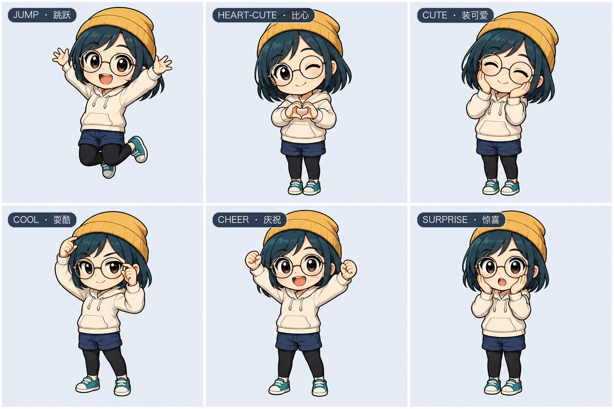

# Hatch Pet V2 Workflow

[](https://github.com/daizhengwei888/hatch-pet-v2-workflow/actions/workflows/ci.yml)
[](LICENSE)
[](https://github.com/daizhengwei888/hatch-pet-v2-workflow/releases)

把人物参考图稳定地做成原生 Codex v2 桌宠：**可断点续做、可局部修复、可验证、可安全更新**。

> From reference images to reliable Codex v2 pets — resumable, repairable, and cache-safe.

## 为什么用它

- **原生 v2 完整支持**：生成 `1536×2288`、8×11 图集，保留 9 个标准状态与 16 个连续看向方向。
- **点击不只会跳**：内置 `heart-cute`、`cute`、`cool`、`cheer`、`surprise`、`jump` 六种五帧互动预设，同时保持原生 Codex 兼容。
- **同人物多穿搭不漂脸**：通过 family identity contract 共享脸型、发型、比例和画风，只为各款替换服装与互动。
- **失败只重做失败行**：运行状态可恢复；裁切、动作或身份问题按行重试，不必推倒整张图集。
- **QA 不是“看起来差不多”**：包含图集几何、逐行动画、方向盲测、方向连续性、透明未使用格和最终包验证。
- **专门处理深色头发白边**：提供色键去色、暗发边缘净化与可选重抠流程，减少小尺寸桌宠常见白边/色边。
- **更新不被旧缓存吞掉**：内容寻址安装与 `refresh-install --force-new-path` 会切换到新路径，避免 Codex 继续读取旧精灵图。
- **更省生成与上下文**：聚合确认图、短 worker prompt、并行任务和定向修复，减少重复生成及主代理反复查看素材。

## 六种原生点击互动



图中展示每种预设最有辨识度的峰值姿势。实际宠物仍使用原生 row 4 的五帧时序，完整播放“准备 → 动作 → 保持 → 回位”；每只宠物选择其中一种固定互动，不会在一次点击中随机切换。

## 与官方基础版的差异

以下对比固定到 OpenAI `hatch-pet` 的 [`49f948f`](https://github.com/openai/skills/tree/49f948faa9258a0c61caceaf225e179651397431/skills/.curated/hatch-pet) 快照（2026-06-23），不代表官方后续版本。

| 能力 | 官方快照 | 本项目 |
|---|---:|---:|
| Codex 图集 | 8×9，9 个状态 | **8×11，9 状态 + 16 方向** |
| 点击动作 | 跳跃 | **6 种固定互动预设** |
| 同人物多穿搭 | 单宠物流程 | **共享身份合同 + 一次确认** |
| 中断恢复 | 手工衔接 | **状态机断点续做** |
| 修复粒度 | 重新处理较多步骤 | **只替换失败行** |
| 方向 QA | 无 v2 方向行 | **锚点盲测 + 连续性检测** |
| 头发边缘 | 通用色键处理 | **暗发白边/色边专项清理** |
| 安装更新 | 常规复制 | **内容寻址、缓存安全刷新** |
| 自动测试 | 基础脚本 | **47 项通过，1 项可选模型测试跳过** |

## 安装

### 推荐：作为 Codex 插件安装

```bash
codex plugin marketplace add daizhengwei888/hatch-pet-v2-workflow
codex plugin add hatch-pet-v2-workflow@hatch-pet-v2-workflow
```

安装后新建一个 Codex 任务或重启 Codex。这个插件内的技能名仍是 `$hatch-pet`；若同时启用了官方同名技能，建议停用其中一个，或明确指定本插件。

### 仅安装 Skill

在 Codex 中运行：

```text
$skill-installer install https://github.com/daizhengwei888/hatch-pet-v2-workflow/tree/main/plugins/hatch-pet-v2-workflow/skills/hatch-pet
```

## 直接这样用

```text
$hatch-pet 根据这个原创角色设定图制作两套 Codex v2 桌宠造型，共用同一人物身份合同。
日常款点击时比心，探险款点击时庆祝。失败只重做对应行，完成后安装并做最终 QA。
```

```text
$hatch-pet 检查这个宠物包：修复深色头发周围的白边、启动时缺腿、方向行和互动动作，验证后缓存安全地覆盖安装。
```

```text
$hatch-pet 恢复上次 demo-character family 运行，只继续未完成或 QA 失败的行，不重新生成已经通过的素材。
```

## 工作流

```text
init → ready → generate → verify → retry/repair → package
```

1. 锁定人物身份、穿搭变体和互动预设。
2. 聚合确认主形象与互动峰值帧，只确认一次。
3. 并行生成标准动画与四方向锚点。
4. 失败按行路由到机械修复或定向重生成。
5. 生成方向行、执行盲测和连续性 QA。
6. 只做一次最终边缘净化，装配并验证原生 v2 包。
7. 用内容哈希路径安装；更新已有宠物时强制切换新资源路径。

## 兼容与要求

- 支持插件的 Codex 桌面版或 CLI。
- 生成角色图时使用 Codex 内置图像生成能力。
- 脚本主要依赖 Python 与 Pillow；测试还使用 NumPy、PyYAML。
- 高级重抠是可选路径，需要额外的 ONNX 模型与依赖；没有模型时对应测试会安全跳过。
- 仓库不包含任何用户照片、生成宠物包或私人运行产物。

## 验证

```bash
python -m unittest discover \
  -s plugins/hatch-pet-v2-workflow/skills/hatch-pet/tests \
  -p 'test_*.py'
```

## 许可证与来源

Apache-2.0。项目基于 OpenAI 的 `hatch-pet` Skill 修改；上游版本、修改文件与主要差异见 [NOTICE](NOTICE)。本项目是非官方社区扩展，不代表 OpenAI 背书。
